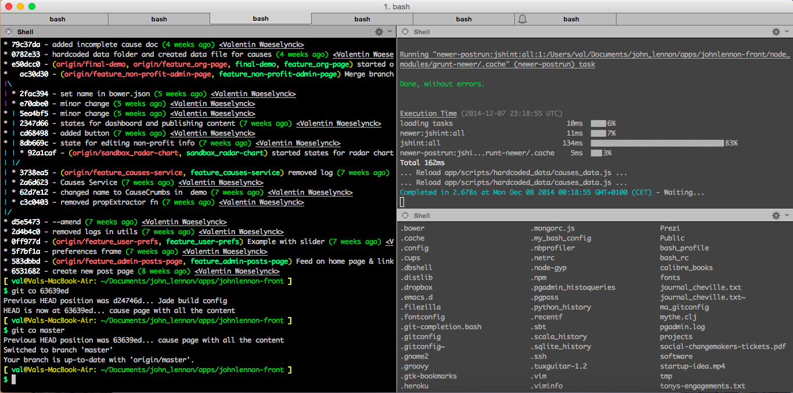

<Title/>



Terminal'de yaşamak diyince aklıma hemen [iterm2](https://www.iterm2.com/) ve [oh-my-zsh](https://github.com/robbyrussell/oh-my-zsh) geliyor. Bu ikisi olmadan macOS'ta terminal yaşamını keyifli bulmuyorum. Ubuntu kullanmak daha keyifli geliyor.

[oh-my-zsh](https://github.com/robbyrussell/oh-my-zsh) ile ilgili uzun uzun konuşmak lazım ama şimdilik günlük yaşantımın parçası olan [itermocil](https://github.com/TomAnthony/itermocil)'den bahsetmek istiyorum.

itermocil; Iterm2 içinde bir pencereyi birden fazla pencereye ayırmanıza yarıyor. Aynı anda ekranı 2 veya daha fazla pencereye bölebiliyorsunuz. Bir pencerede IPython shell, diğerinde Django Run Server, üçüncü pencerede ise yine aynı proje içerisinde shell'de kalmayı seviyorum. Bu ayarların hepsini yml dosyaları oluşturarak yapabiliyorsunuz. Muhakkak deneyin ;)

Üç Panel Örneği:

```
windows:
  - name: sample-three-panes
    root: ~/Code/sample/www/projectX/projectX_dj
    layout: main-vertical
    panes:
      - commands:
        - source ../env/bin/activate
        - python manage.py shell_plus --bpython
      - commands:
        - source ../env/bin/activate
        - ./manage.py runserver 0:8000
      - source ../env/bin/activate
```

Tüm örnekler:
[itermocil layouts](https://github.com/TomAnthony/itermocil/blob/master/LAYOUTS.md)
